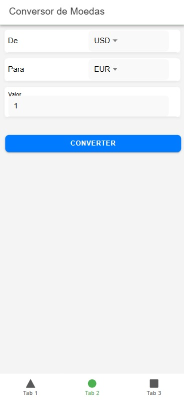

# Conversor de Moedas - Ionic

Este é um aplicativo de conversão de moedas desenvolvido com **Ionic Framework** e **Angular**. Ele permite realizar conversões entre diferentes moedas usando taxas de câmbio atualizadas em tempo real.

---

## 📋 Funcionalidades

- Conversão de moedas em tempo real.
- Histórico de conversões recentes.
- Interface responsiva e fácil de usar.
- Funcionalidade offline (usando dados salvos localmente).
- Página com informações da equipe do projeto.

⚙️ Pré-requisitos
Node.js (v16 ou superior)
Ionic CLI (instale com npm install -g @ionic/cli)
🛠️ Contribuindo
Veja o arquivo CONTRIBUTING.md para informações detalhadas sobre como contribuir.

👥 Autores
Jean Ricardo França da Silva - 01583760
Pedro de Melo Albuquerque - 01608588
Paulo Vinícius Feliciano de Souza - 01618133
Lucas Maia Sivini - 01616874
Bruno Lourenço Bezerra - 01606518
Lucas Araújo da Silva - 01589449

